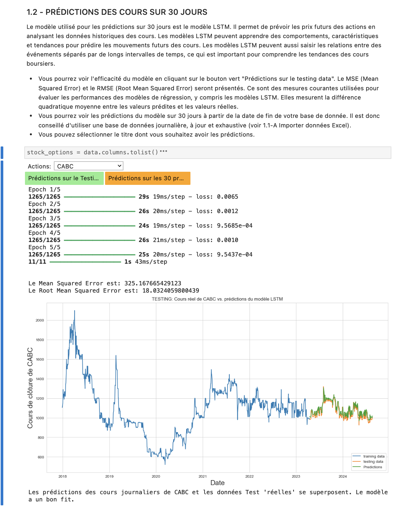

## OVERVIEW

This repository contains an interactive Jupyter Notebook designed to perform stock price predictions using Keras.             

**PLATEFORME PREDICTIONS.ipynb**   

*Price Prediction Platform*     

* Uses LSTM (Long Short-Term Memory) models to predict stock prices.
* Implements MinMax Scaling for data preprocessing.
* Provides interactive UI elements for user input and selection.
* Outputs 30-day forecasts and evaluates model accuracy.     

**Getting Started**

You will need to install from statsmodels...and ipywidgets pip using the following command:

* !pip install seaborn         

* !pip install ipywidgets    

## User Interface Preview

Here’s what the platform looks like:

